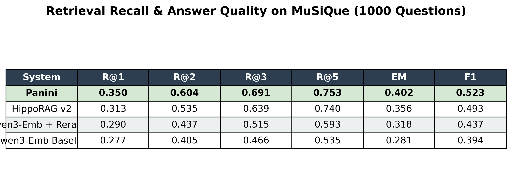
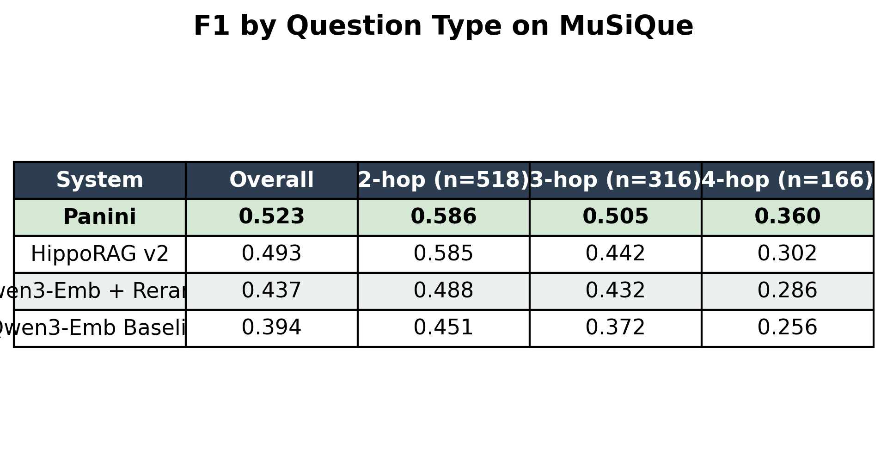
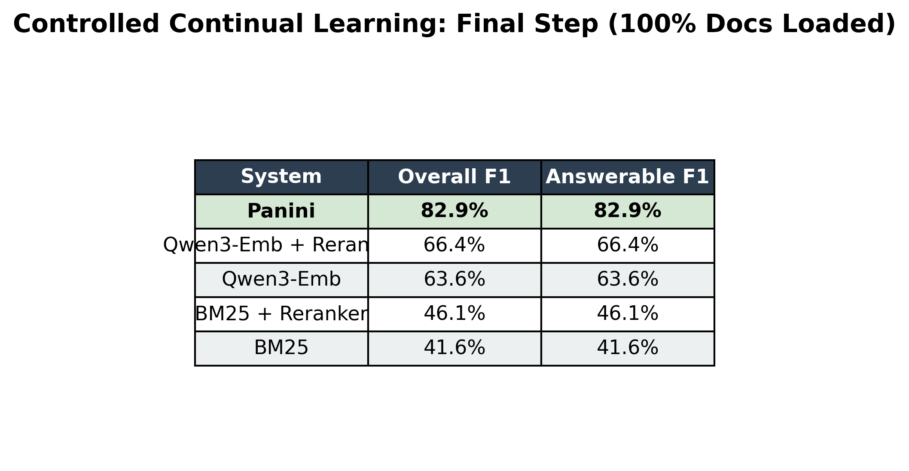
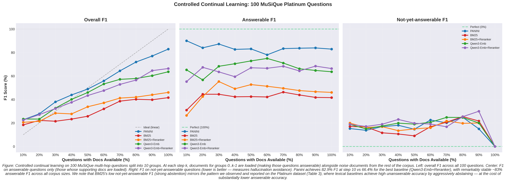
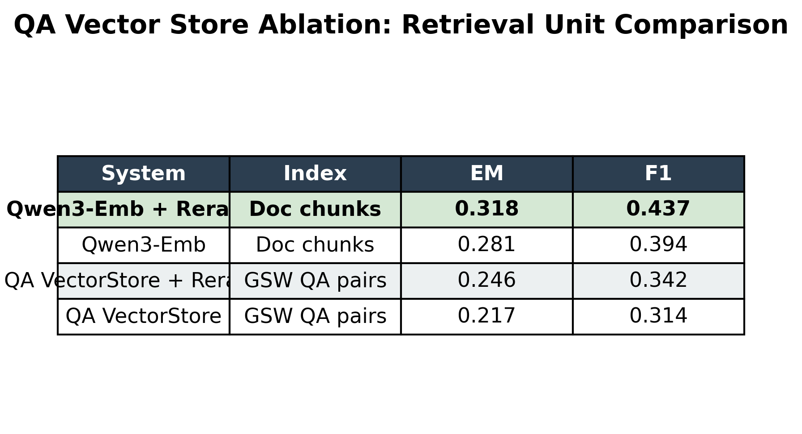

# Panini Rebuttal: Additional Experiments

## 1. Retrieval Recall (Recall@K)

We trace each retrieved evidence piece back to its source document and check whether it is a gold supporting document. Recall@K measures the fraction of supporting documents covered using only the top-K retrieved evidence.

| System | R@1 | R@2 | R@3 | R@5 | EM | F1 |
|--------|-----|-----|-----|-----|----|----|
| **Panini** | **0.350** | **0.604** | **0.691** | **0.753** | **0.402** | **0.523** |
| HippoRAG v2 | 0.313 | 0.535 | 0.639 | 0.740 | 0.356 | 0.493 |
| Qwen3-Emb + Reranker | 0.290 | 0.437 | 0.515 | 0.593 | 0.318 | 0.437 |
| Qwen3-Emb Baseline | 0.277 | 0.405 | 0.466 | 0.535 | 0.281 | 0.394 |

Panini achieves the highest recall at every K value from 1 to 5, retrieving fewer but more relevant documents. Panini covers 75.3% of supporting documents with just 3.7 unique documents on average (at K=5), while HippoRAG needs 10+ documents to reach similar coverage.

### Panini Detailed Retrieval Metrics

| K (evidence) | Avg Docs Retrieved | Recall@K |
|---|---|---|
| 1 | 1.0 | 0.350 |
| 2 | 2.0 | 0.604 |
| 3 | 2.7 | 0.691 |
| 5 | 3.7 | 0.753 |
| 10 | 4.4 | 0.772 |
| 15 | 4.4 | 0.772 |

| Metric | Value |
|--------|-------|
| Questions Scored | 1000 |
| Mean Doc Recall (all evidence) | 0.772 |
| Full Coverage Rate | 0.527 |
| Mean QA Precision | 0.674 |
| Mean Doc Precision | 0.606 |
| Mean Evidence Count | 6.7 |
| Doc Recall vs F1 Correlation | 0.287 |

### Panini Recall@K by Hop Count

| Hops | N | Gold Docs | R@1 | R@2 | R@5 | R@10 | Full Coverage | Avg Docs | Ans F1 |
|------|---|-----------|-----|-----|-----|------|---------------|----------|--------|
| 2-hop | 518 | 2 | 0.424 | 0.738 | 0.843 | 0.856 | 73.6% | 3.8 | 0.586 |
| 3-hop | 316 | 3 | 0.303 | 0.519 | 0.730 | 0.757 | 39.9% | 4.3 | 0.505 |
| 4-hop | 166 | 4 | 0.211 | 0.343 | 0.518 | 0.535 | 12.0% | 6.1 | 0.360 |

### Retrieval-Answer Quality Correlation

| Doc Recall | N | Mean Answer F1 |
|------------|---|----------------|
| 0% | 22 | 0.155 |
| 1-50% | 81 | 0.357 |
| 51-99% | 370 | 0.412 |
| 100% | 527 | 0.641 |

Pearson correlation between document recall and answer F1: **r = 0.287**, confirming that better retrieval directly drives better answers.

---

## 2. Full-Scale MuSiQue Results by Question Type (1000 Questions)

### Overall

| System | EM | F1 |
|--------|-----|-----|
| **Panini** | **0.402** | **0.523** |
| HippoRAG v2 | 0.356 | 0.493 |
| Qwen3-Emb + Reranker | 0.318 | 0.437 |
| Qwen3-Emb Baseline | 0.281 | 0.394 |

### 2-hop (n=518)

| System | EM | F1 |
|--------|-----|-----|
| **Panini** | **0.465** | **0.586** |
| HippoRAG v2 | 0.435 | 0.585 |
| Qwen3-Emb + Reranker | 0.365 | 0.488 |
| Qwen3-Emb Baseline | 0.342 | 0.451 |

### 3-hop (n=316)

| System | EM | F1 |
|--------|-----|-----|
| **Panini** | **0.386** | **0.505** |
| HippoRAG v2 | 0.306 | 0.442 |
| Qwen3-Emb + Reranker | 0.310 | 0.432 |
| Qwen3-Emb Baseline | 0.241 | 0.372 |

### 4-hop (n=166)

| System | EM | F1 |
|--------|-----|-----|
| **Panini** | **0.235** | **0.360** |
| HippoRAG v2 | 0.202 | 0.302 |
| Qwen3-Emb + Reranker | 0.187 | 0.286 |
| Qwen3-Emb Baseline | 0.169 | 0.256 |

Panini leads overall and across all hop counts. On 2-hop, Panini and HippoRAG are essentially tied (0.586 vs 0.585). The gap widens as hop count increases: +6.3 F1 on 3-hop, +5.8 F1 on 4-hop. This demonstrates that structured GSW memory with chain-following retrieval is especially advantageous for complex multi-hop reasoning.

---

## 3. Controlled Continual Learning

### Setup

100 MuSiQue multi-hop questions, split into 10 groups of 10. At each step k, we load documents for groups 0..k-1 (making those questions answerable) plus noise documents from the rest of the corpus, then evaluate all 100 questions.

**Goal:** Measure how each method handles a growing corpus -- can it find the right answers as documents become available, while avoiding hallucination on questions whose documents are not loaded yet?

**Methods:** Panini (GSW-based decompose -> chain-follow -> answer) vs 4 retrieval baselines (BM25, BM25+Reranker, Qwen3-Embedding, Qwen3-Embedding+Reranker).

### Overall F1 by Step

| Step | Answerable % | Panini | BM25 | BM25+RR | Qwen3-Emb | Qwen3-Emb+RR |
|------|-------------|--------|------|---------|-----------|--------------|
| 1 | 10% | 22.7 | 18.4 | 20.6 | 23.4 | 22.5 |
| 2 | 20% | 27.8 | 22.2 | 21.4 | 23.3 | 27.1 |
| 3 | 30% | 38.0 | 21.5 | 28.4 | 32.7 | 32.3 |
| 4 | 40% | 43.9 | 23.3 | 27.7 | 40.1 | 37.6 |
| 5 | 50% | 48.9 | 25.7 | 33.8 | 46.0 | 43.4 |
| 6 | 60% | 55.8 | 32.0 | 37.2 | 53.2 | 47.6 |
| 7 | 70% | 64.4 | 38.6 | 41.2 | 57.2 | 52.8 |
| 8 | 80% | 71.9 | 40.2 | 42.0 | 57.9 | 56.5 |
| 9 | 90% | 77.0 | 39.8 | 44.0 | 60.3 | 64.6 |
| **10** | **100%** | **82.9** | 41.6 | 46.1 | 63.6 | 66.4 |

### Answerable-Only F1 by Step

| Step | Answerable % | Panini | BM25 | BM25+RR | Qwen3-Emb | Qwen3-Emb+RR |
|------|-------------|--------|------|---------|-----------|--------------|
| 1 | 10% | **90.0** | 30.9 | 26.4 | 65.2 | 55.2 |
| 2 | 20% | **84.0** | 44.5 | 42.5 | 56.7 | 67.4 |
| 3 | 30% | **87.2** | 44.5 | 55.3 | 68.3 | 63.5 |
| 4 | 40% | **82.7** | 42.3 | 49.1 | 70.5 | 59.4 |
| 5 | 50% | **83.1** | 42.4 | 52.7 | 72.9 | 67.0 |
| 6 | 60% | **78.0** | 42.2 | 51.3 | 75.0 | 66.6 |
| 7 | 70% | **83.4** | 46.3 | 49.6 | 71.0 | 68.3 |
| 8 | 80% | **83.7** | 43.9 | 47.6 | 66.2 | 64.3 |
| 9 | 90% | **83.9** | 41.8 | 46.7 | 64.8 | 68.4 |
| **10** | **100%** | **82.9** | 41.6 | 46.1 | 63.6 | 66.4 |

### Key Findings

1. **Panini dominates** -- 82.9% F1 at step 10 vs 66.4% for the best baseline (Qwen3-Emb+RR), a gap of +16.5 F1.
2. **Panini's answerable F1 is remarkably stable** -- approximately 83% across all steps regardless of corpus size. The baselines degrade as the corpus grows (Qwen3-Emb drops from 65% to 64%).
3. **Panini scales cleanly** -- overall F1 rises linearly as more groups become answerable, meaning it finds new answers without losing old ones.
4. **BM25 alone is weak** (~42% F1) -- reranking helps but not enough. Dense retrieval (Qwen3-Emb) is much stronger but still 17 points below Panini.

The experiment demonstrates that structured GSW memory (decompose the question, follow entity chains) is fundamentally more robust than retrieve-and-read as the corpus scales.

---

## 4. QA Vector Store Ablation

### Research Question

What happens if you replace raw document chunks with GSW's pre-extracted QA pairs as the retrieval unit, keeping everything else constant (same embedding model, same top-k, same answer generator)?

### Setup

| | Chunk Baseline (Qwen3-Emb) | QA Vector Store |
|---|---|---|
| **Index contents** | Raw corpus paragraphs (title + text) | GSW QA pairs (Q: Who is X? A: Y) |
| **Index size** | ~11.6K documents | ~231K QA pairs extracted from GSWs |
| **Retrieval** | Qwen3-Embedding-8B, FAISS top-5 | Qwen3-Embedding-8B, FAISS top-5 |
| **Answer generation** | GPT-4o-mini, oracle-style prompt | GPT-4o-mini, oracle-style prompt |
| **Dataset** | MuSiQue, 1000 questions | MuSiQue, 1000 questions |

### Results

| System | EM | F1 |
|--------|-----|-----|
| Qwen3-Emb + Reranker (chunks) | 0.318 | 0.437 |
| Qwen3-Emb (chunks) | 0.281 | 0.394 |
| QA Vector Store + Reranker | 0.246 | 0.342 |
| QA Vector Store (no reranker) | 0.217 | 0.314 |

### By Question Type

| System | 2-hop F1 | 3-hop F1 | 4-hop F1 |
|--------|----------|----------|----------|
| Qwen3-Emb + Reranker (chunks) | 0.488 | 0.432 | 0.286 |
| Qwen3-Emb (chunks) | 0.451 | 0.372 | 0.256 |
| QA Vector Store + Reranker | 0.376 | 0.321 | 0.275 |
| QA Vector Store (no reranker) | 0.324 | 0.319 | 0.271 |

### Interpretation

Naively embedding individual GSW QA pairs and doing top-k retrieval performs worse than embedding raw document chunks. This is expected: individual QA pairs are short and decontextualized, so embedding similarity struggles to match them to complex multi-hop questions. The QA pairs contain the right information (as Panini's 82.9% F1 on the continual learning experiment demonstrates), but flat vector similarity is the wrong retrieval mechanism for them. Panini's chain-following approach -- decompose the question into sub-questions, match entities, follow chains through the GSW structure -- is essential to unlocking the value of pre-extracted QA pairs.
